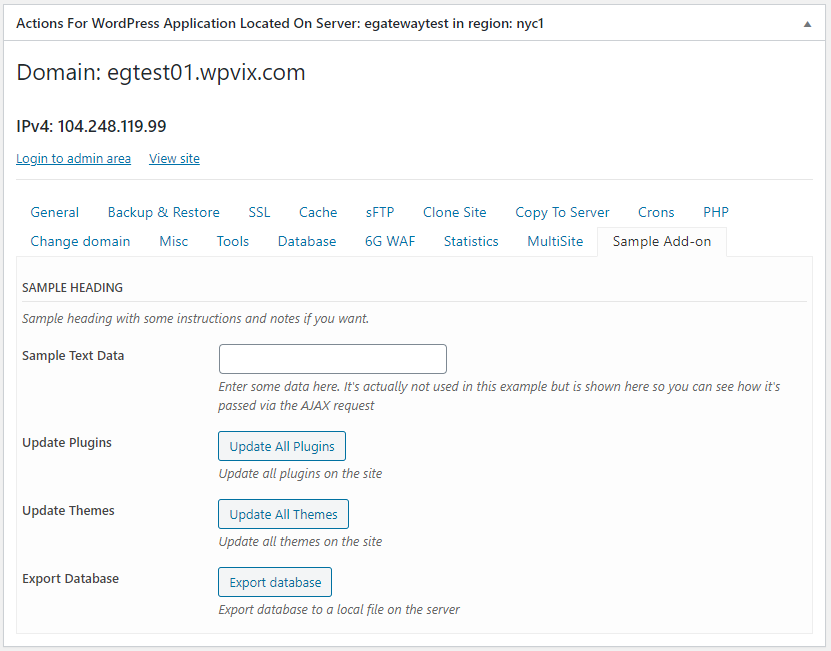

# Description #

**A sample extension to the WPCloud Deploy WordPress plugin. **

This plugin adds a "sample add-on" tab to the WPCD App Details page.
In that tab, there is a button that updates all plugins on the site.
There is another sample inactive button and an inactive text field.

You can use this plugin as a starting point to create your own
addons for WPCloud Panel (former WPCloud Deploy).

[Read this article for instructions on customizing this WPCD add-on.](https://wpclouddeploy.com/how-to-add-custom-functionality-to-wpcd-part-1/)

[Main WPCloudPanel Website.](https://wpclouddeploy.com/)

### Change Log ###
1.0.0
------
* Initial Release